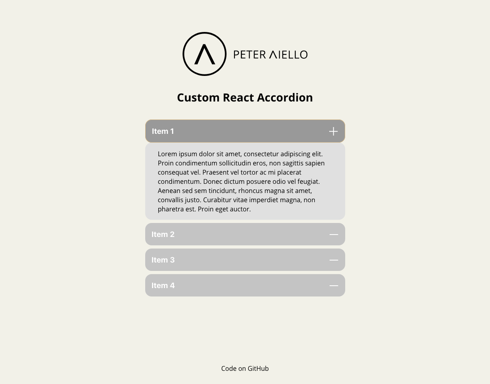

# Custom React Accordion

**Component Brief:** 
- The first item of the accordion should be active by default. 
- The markup and design patterns of the component should adhere to W3 accessibility standards as per their documentation (this includes keyboard input and the appropriate aria controls).
- Instead of hardcoding the content, it would be great if the app included JSON formatted data. 